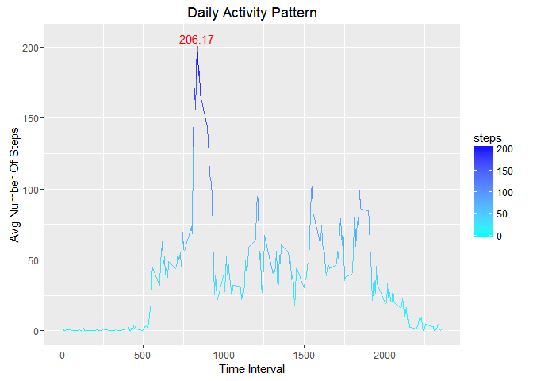
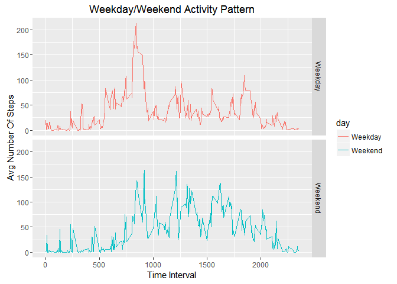

# Reproducible Research: Peer Assessment 1
Smita  
25 July 2016  
We will first Install the required packages

```r
library(ggplot2)
library(scales)
library(mice)
```
## Loading and preprocessing the data


```r
#1.Load the data (i.e. read.csv())
if (!file.exists("activity.csv"))
    unzip("activity.zip")

activity <- read.csv(file="activity.csv")

#2.Process/transform the data (if necessary) into a format suitable for your analysis
nonNAactivity <- activity[complete.cases(activity), ]
```


## What is mean total number of steps taken per day?


```r
#1. Calculate the total number of steps taken per day
total_steps_day1 <- aggregate(steps~ date ,nonNAactivity,sum,na.omit=TRUE) 

colnames(total_steps_day1)<- c("date","steps")


#2. If you do not understand the difference between a histogram and a barplot, research the difference between them. Make a histogram of the total number of steps taken each day

hist(total_steps_day1$steps, main="Histogram Of Total Steps Per Day", xlab="Steps per day",col="pink")

#3.Calculate and report the mean and median of the total number of steps taken per day

mean_steps_day1 <- round(mean(total_steps_day1$steps,na.rm = TRUE),digits = 0)
median_steps_day1 <- median(total_steps_day1$steps)

abline(v=mean_steps_day1,col="blue", lwd=3)

text(mean_steps_day1-500, 20, paste("Mean =", mean_steps_day1),cex=0.7,col="blue",srt=90)
```


The mean and median of the total number of steps taken per day are 
``1.0767\times 10^{4}`` and ``10766`` respectively.

## What is the average daily activity pattern?

```r
#1.Make a time series plot (i.e. type = "l") of the 5-minute interval (x-axis) and the average number of steps taken, averaged across all days (y-axis)
dat <- aggregate(steps ~ interval, nonNAactivity,mean)

p1 <- ggplot(dat,aes(x=interval,y=steps,color=steps)) + geom_line() + scale_colour_gradient(low="cyan", high="blue", limits=c(0,206))+ ggtitle("Daily Activity Pattern") + ylab("Avg Number Of Steps") + xlab("Time Interval")

#2. Which 5-minute interval, on average across all the days in the dataset, contains the maximum number of steps?
#
max_steps <- dat[dat$steps==max(dat$steps),]

p1 + geom_text(data=max_steps,aes(x=interval,y=max_steps$steps),label=round(max_steps$steps,digits = 2),col="red")
```



The plot shows that the daily activity is high during the interval 600 to 900 and then moderate over 1200 to 1800 interval.The  ``835`` interval contains the maximum number of steps ``206``

## Imputing missing values

```r
#1. Calculate and report the total number of missing values in the dataset (i.e. the total number of rows with NAs)

#Total no of missing values in the activity dataset
sum(is.na(activity$steps))
```

```
## [1] 2304
```

```r
#lets check the summary
summary(activity)
```

```
##      steps                date          interval     
##  Min.   :  0.00   2012-10-01:  288   Min.   :   0.0  
##  1st Qu.:  0.00   2012-10-02:  288   1st Qu.: 588.8  
##  Median :  0.00   2012-10-03:  288   Median :1177.5  
##  Mean   : 37.38   2012-10-04:  288   Mean   :1177.5  
##  3rd Qu.: 12.00   2012-10-05:  288   3rd Qu.:1766.2  
##  Max.   :806.00   2012-10-06:  288   Max.   :2355.0  
##  NA's   :2304     (Other)   :15840
```

```r
#2. Devise a strategy for filling in all of the missing values in the dataset. The strategy does not need to be sophisticated. For example, you could use the mean/median for that day, or the mean for that 5-minute interval, etc.
md.pattern(activity)
```

```
##       date interval steps     
## 15264    1        1     1    0
##  2304    1        1     0    1
##          0        0  2304 2304
```

```r
imputedActivity <- mice(activity)
```

```
## 
##  iter imp variable
##   1   1  steps
##   1   2  steps
##   1   3  steps
##   1   4  steps
##   1   5  steps
##   2   1  steps
##   2   2  steps
##   2   3  steps
##   2   4  steps
##   2   5  steps
##   3   1  steps
##   3   2  steps
##   3   3  steps
##   3   4  steps
##   3   5  steps
##   4   1  steps
##   4   2  steps
##   4   3  steps
##   4   4  steps
##   4   5  steps
##   5   1  steps
##   5   2  steps
##   5   3  steps
##   5   4  steps
##   5   5  steps
```

```r
#3.Create a new dataset that is equal to the original dataset but with the missing data filled in.
modifiedActivity <- complete(imputedActivity)
summary(modifiedActivity)
```

```
##      steps                date          interval     
##  Min.   :  0.00   2012-10-01:  288   Min.   :   0.0  
##  1st Qu.:  0.00   2012-10-02:  288   1st Qu.: 588.8  
##  Median :  0.00   2012-10-03:  288   Median :1177.5  
##  Mean   : 38.64   2012-10-04:  288   Mean   :1177.5  
##  3rd Qu.: 15.00   2012-10-05:  288   3rd Qu.:1766.2  
##  Max.   :806.00   2012-10-06:  288   Max.   :2355.0  
##                   (Other)   :15840
```

```r
#4.Make a histogram of the total number of steps taken each day and Calculate and report the mean and median total number of steps taken per day. Do these values differ from the estimates from the first part of the assignment? What is the impact of imputing missing data on the estimates of the total daily number of steps?


#Lets find the number of steps taken per day
total_steps_day2 <- aggregate(modifiedActivity$steps,list(modifiedActivity$date),sum,na.omit=TRUE) 

colnames(total_steps_day2)<- c("date","steps")


# Now lets compute the mean total number of steps taken per day.
mean_steps_day2 <- round(mean(total_steps_day2$steps,na.rm = TRUE),digits=0)
median_steps_day2 <- median(total_steps_day2$steps)

#Plot the histogram of total steps taken per day.

hist(total_steps_day2$steps, main="Histogram Of Total Steps Per Day", xlab="Steps per day",col="pink")
abline(v=mean_steps_day2,col="blue", lwd=3)
text(mean_steps_day2-500, 20, paste("Mean =", mean_steps_day2),cex=0.7,col="blue",srt=90)
```


The mean steps per day before imputing values was ``1.0767\times 10^{4}`` after imputing the values the mean steps per day changed to 
``1.1131\times 10^{4}``

## Are there differences in activity patterns between weekdays and weekends?

```r
#1. Create a new factor variable in the dataset with two levels – “weekday” and “weekend” indicating whether a given date is a weekday or weekend day.
modifiedActivity$date <- as.Date(modifiedActivity$date)
condition <- weekdays(modifiedActivity$date) %in% c("Saturday","Sunday")
modifiedActivity$day[condition] <- "Weekend"
modifiedActivity$day[!condition] <- "Weekday"

#2. Make a panel plot containing a time series plot (i.e. type = "l") of the 5-minute interval (x-axis) and the average number of steps taken, averaged across all weekday days or weekend days (y-axis).
dat2 <-aggregate(steps ~  interval + day, modifiedActivity,mean)
ggplot(dat2,aes(interval,steps,group=day)) + geom_line(aes(color=day)) + facet_grid(day~.) + ggtitle("Weekday/Weekend Activity Pattern") + ylab("Avg Number Of Steps") + xlab("Time Interval")
```


